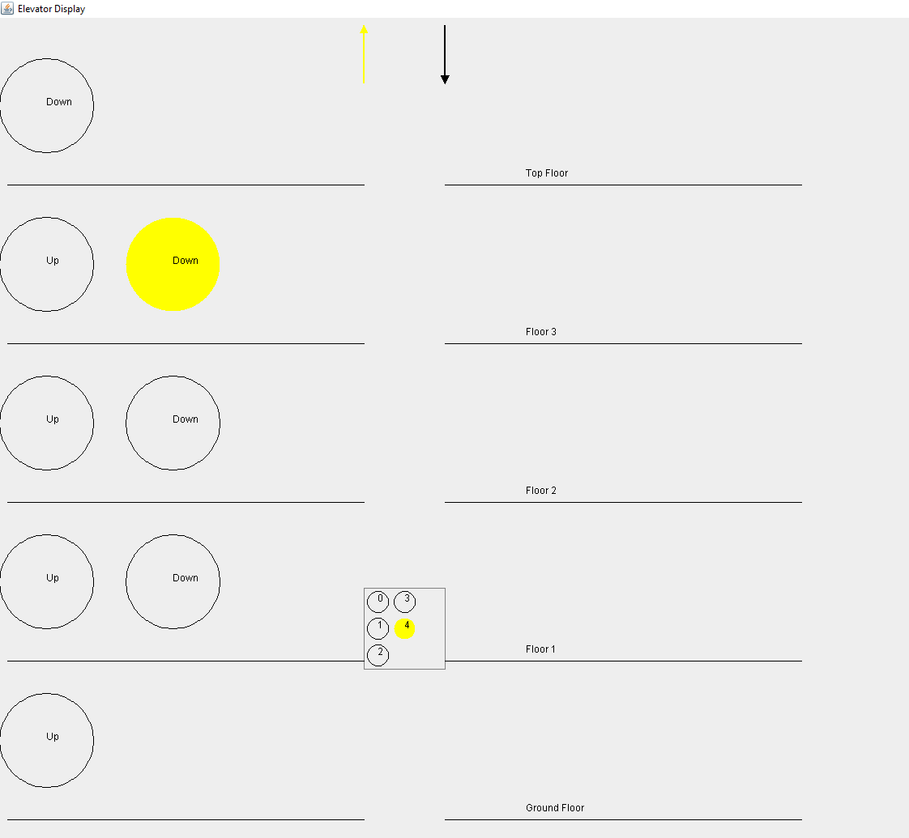

# Elevator Control System

## Table of Contents
1. [Description](#description)
2. [Installation](#installation)
3. [Usage](#usage)
4. [Assumptions](#assumptions)
5. [Features](#features)
6. [Bugs](#bugs)

## Description
**The Elevator** is a simulation of an elevator system written in Java. It provides the user with cli control of a configurable elevator system that will output the animated system with Swing.

- Handles real-time updates of elevator positions.
- Performs optimization calculations to simulate actual elevator behavior.
- Allows for interaction via command-line.
- Scalable & configurable with arbitrary number of floors/buttons (not currently supported through cli, and not thoroughly tested)

Below is a screenshot of a running instance of the application. FloorButton 4 and Floor 3's 'Down' CallButton are pressed. The elevator is in motion upwards towards floor 4.

## Installation
1. Clone the repository:
   git clone https://github.com/Swampfox142/The-Elevator.git
2. Navigate to the project directory:
   cd The-Elevator
3. Compile the Java source code:
   javac -d build RunElevator.java
4. Run the application:
   java -cp build RunElevator

## Usage
1. Enter commands to control the elevator, such as:
   - '3': presses the '3' button while inside the elevator.
   - '3 up': presses the 'up' button on floor 3, outside of the elevator.
2. View the Swing output that will animate the button presses and the elevator moving from floor to floor.
3. Enter 'exit' to stop the application.

## Features - Implemented and Planned
- [x] Real-time position tracking and elevator animation
- [x] Real-time button highlights and updates
- [x] Controllable buttons
- [x] Scalable, agnostic design
- [ ] Open/Close door buttons (planned)
- [ ] Emergency Stop button (planned)
- [ ] GUI-supported user input (unplanned)
- [ ] Multiple Elevators (unplanned)

## Assumptions
No system requirements were provided beyond 'Provide code that simulates an elevator'. Given these minimal specifications, I propose a simple, agnostic, and scalable design that covers the most common elevator features and provides support for various types of elevators to be implemented later.
Various types of elevators that may come to mind or expect to be added as a requirement later include: service elevators (weight capacity, extra safety features, restricted floors), dumbwaiters (no internal elevator controls), multi-sided elevators, etc. By starting with an agnostic 'Elevator' class that has 'Buttons' and 'Floors', all of these features can easily be implemented by adding proerties and methods to the existing base class. Evidence of the scalability can be seen in the addition of both 'FloorButtons' and 'ElevatorButtons'. Through the initial design with buttons that only designate a floor, potential features that also could be considered 'common' came to mind: open/close door buttons and an emergency stop button. Adding these to the  existing design was as simple as keeping all 'FloorButtons' in a Button subclass with only a floor identifier property and adding a new Button subclass 'ElevatorButtons' that can conatin any properties necessary for these other buttons. TODO comments in the code clearly mark where these features can be easily added to existing methods. While self-imposed time-constraints prevented the full implementation of these features, the base design was easily scalable enough to incluide them.

Unrelated to system design, some features that could have been implied have also be intentionally ommitted. For example, a full-fledged GUI to visualize the simulation. No requirement on this part was given, but it may be assumed to be part of a 'simulation'. For this reason, a basic visualization was provided, but full user input support/interaction as well as complex animations and visuals were ommitted as these features proved to be considerably time-consuming. Another ommitted feature was a multi-elevator system. Multiple elevators could be supported with the current design, but with considerably more rework than the presviously-mentioned features. For instance, the elevator's direction-optimization logic would have to be reworked completely into a multi-threaded elevator 'queue' system to scale to such a design. Technically, the requirements only specified 'an elevator', so this feature could be assumed to not be a requirement.

## Bugs
- UI does not scale dynamically when window size is changed while the application is running.
- Bottom part of UI is cut off the bottom part of the window (full-screen pr dragging the window down fixes the visibility).
